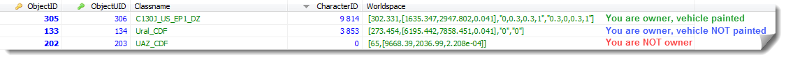

# Paint Vehicles

**Last update: [2017-05-25], v1.1** ([see changelog](#changelog))

---

[Go to Epoch forum thread][scriptthread]

---

## Credits

**All credits goes to its original authors:**

+ **DayZ Epoch developers, collaborators and contributors** (thank you guys for your excellent work!). [Visit them on github][epochdevs]
+ **Maca134** for orginal color vehicle script.
+ **Zupa** for the idea of painting vehicles in two different colors.
+ **0verHeaT** for script public release - this version we are updating for 1.0.6.1+ ([see original thread][overheatthread])
+ **raymix** for list of paintable vehicles for this script ([see original thread][raymixthread])

---

## TOC:
<!-- MarkdownTOC -->

- [Features](#features)
- [How to install](#how-to-install)
- [Battleye](#battleye)
- [infiSTAR](#infistar)
- [Changelog](#changelog)

<!-- /MarkdownTOC -->

---

<a name="features"></a>
## Features

+ Vehicles can be painted in two different colors
+ Only vehicles which you own can be painted (vehicles with key)
+ Only vehicles in `ColourVehicles` array can be painted
+ Script is designed to be used along with **Single currency**. Player will pay for painting vehicles.
+ **UPDATED:** Color values are saved in the worldspace field in database
+ **NEW:** Vehicles can be unpainted to default state (default textures are loaded)
+ **UPDATED:** Vehicles can be painted using GUI with visual enhancements. Use PaintVehicles `defines.hpp` for defining custom GUI color scheme

---

+ **What needs to be done:**
  + #todo: update vehicle classes in `ColourVehicles` array

---


---



---

<a name="how-to-install"></a>
## How to install
We are not using common way how is script included to current folder structure (like grab it and put to the root of mission folder) - that's why **read carefully, use repo folder structure (or similar) and compare tool like diffmerge!**

---

For **client side** we need these folders in the root of your `MPMissions\Dayz_Epoch_11.Chernarus` folder:

+ **actions:** we will store file with scroll action menu command `Paint vehicle` here
+ **compile:** we will store core script client files here
+ **Configs:** we will store defines && dialog config files for script GUI here
+ **gui:** we will store your "Money" or "Coins" picture here
+ **init:** we will load all compiles, variables and public eventhandlers from here

... and finaly files:

+ **description.ext:** we will load your defines and dialogs from here via `master.hpp` 
+ **init.sqf:** we will load your custom compiles, variables and public EH from here

---

For **server side** (`dayz_server`) we need to touch these files:

+ **compiles\server_paintVehicles.sqf** (needs to be created)
+ **compiles\server_updateObject.sqf**
+ **system\server_monitor.sqf**
+ **init\server_functions.sqf**

---

<a name="battleye"></a>
## Battleye

```c
// Add an exception to publicvariable.txt
!="PVDZE_veh_Color"
```

<a name="infistar"></a>
## infiSTAR

```c
// Add an exception to allowed dialogs
571113
```

---

**_...that's all, Have Fun!!_**

---

<a name="changelog"></a>
## Changelog

| Date         | Version | Description                                                         |
| :---         | :---    | :---                                                                |
| [2017-05-22] | v1.0    | Initial release                                                     |
| [2017-05-27] | v1.1    | Optimized compiles: 5 files reduced to 1 main file.<br>See changes: |

---

[scriptthread]: https://epochmod.com/forum/topic/43949-re-release-paint-vehicles-script-using-single-currency-updated-to-1061-and-upgraded/ "Go to source"
[epochdevs]: https://github.com/EpochModTeam/DayZ-Epoch "Go to source"
[overheatthread]: https://epochmod.com/forum/topic/18624-release-paint-vehicles/ "Go to source"
[raymixthread]: https://epochmod.com/forum/topic/19651-extras-full-list-of-paintable-vehicles-for-paint-vehicles-script/ "Go to source"
